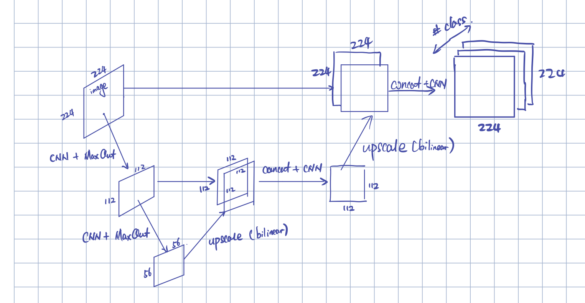
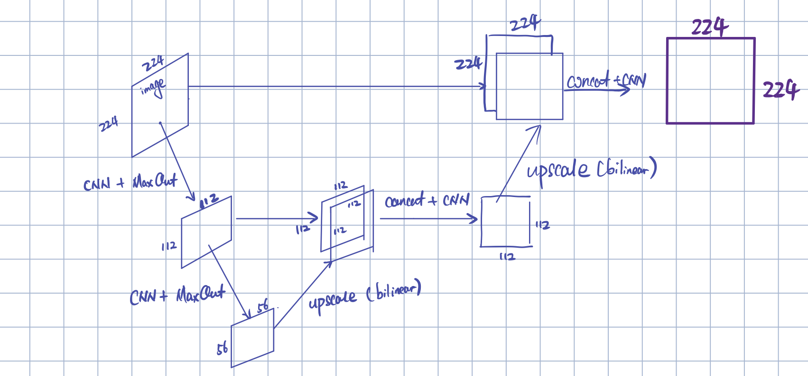
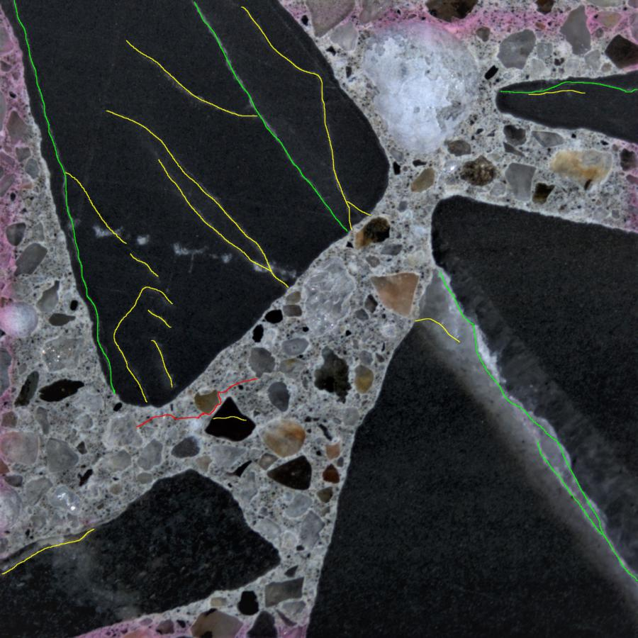
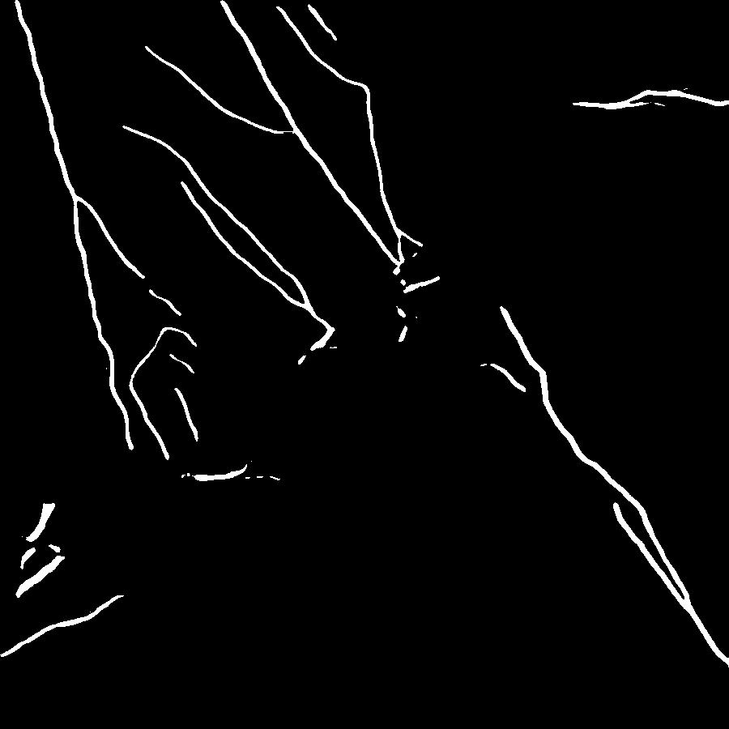
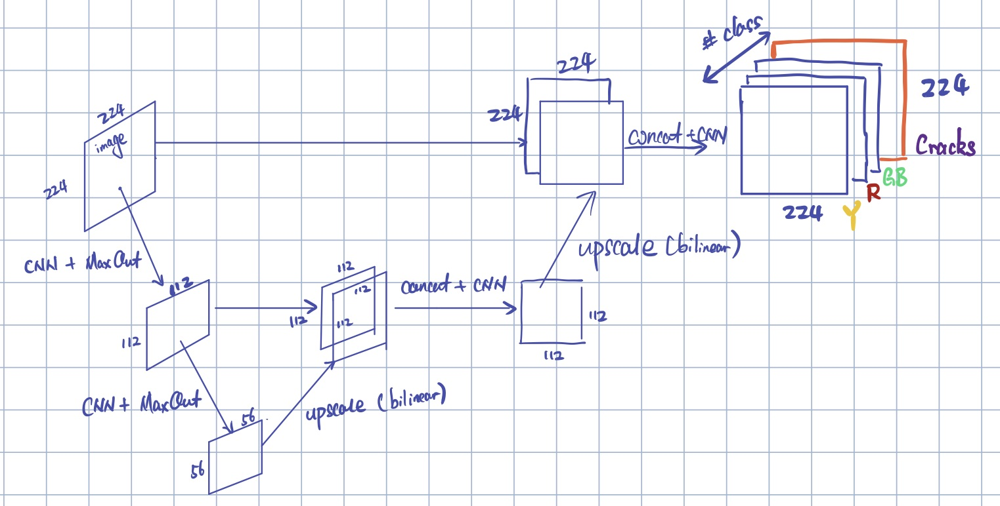
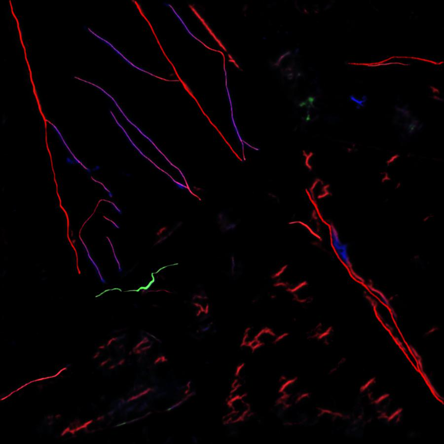
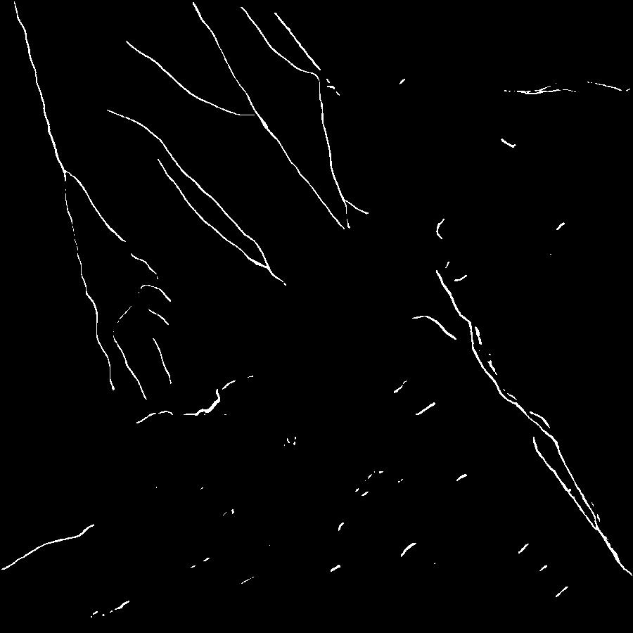
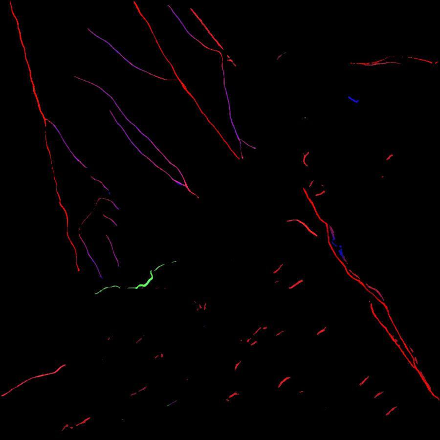
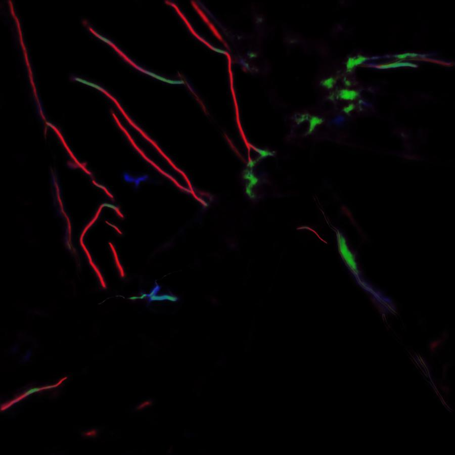
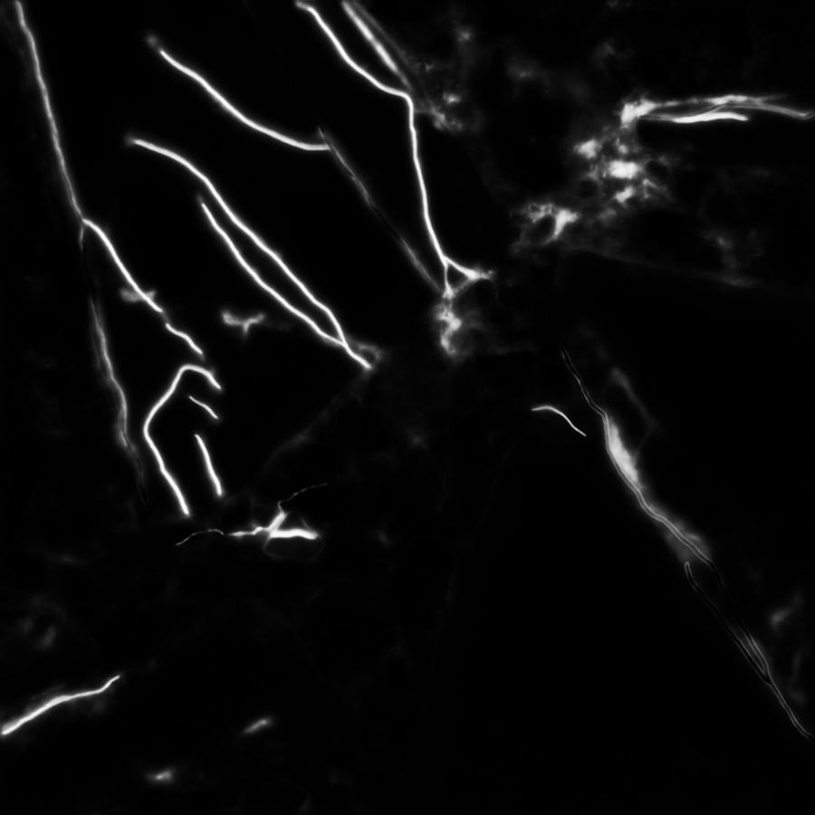

# Nov 20 2020

## Review

Last time, we discussed a Unet-like design:

 

- I reported that the model fails to learn the right features if I directly train the model to implement both crack detection and type classification. 

As a result, we started from implementing the crack detection first:

#### Result
 

## Upgraded model

Regularizers: for each pixel, add the following terms to the loss function
$$\lambda_1 (Y + R + GB - Crack)^2$$
$$\lambda_2 (|Y| + |R| + |GB|)$$

#####Results
  
 
 

#### 'XOR'-problem
The model has a strong intention to classify yellow cracks as green. The logic seems like:

| cracks type | Feature G | Feature Y |
| ----------- | --------- | --------- |
| Y | Yes | Yes |
| G | Yes | No |

So the feature G detector is not diabled when feature Y detector is activated. 

#### Extra Results
Instead of applying regularizers, for each pixel, there are four possible types:
 
 - Y, R, GB, crack-free

I added a softmax layer to produce one-hot labels.

##### Results

  
 

