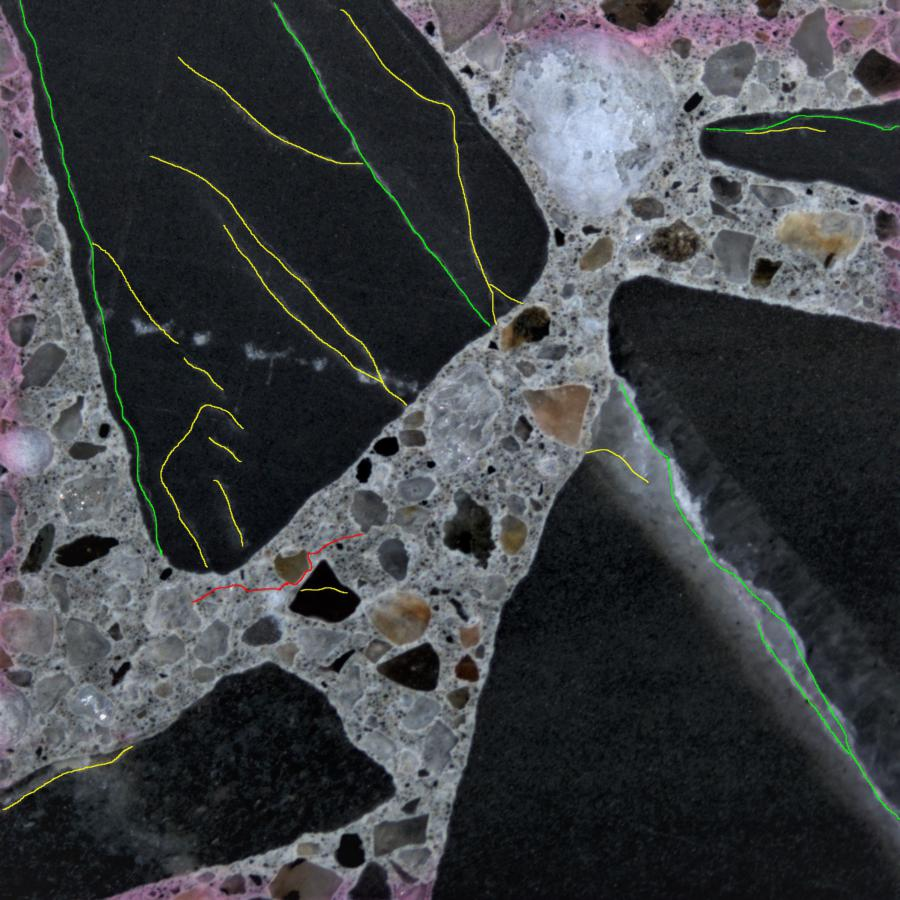

# Nov 20 2020

# Problem of the previous methods
1. Inaccurate predictions
2. The generated heatmap is of a low resolution. 
	- leads to the failure of counting cracks using topological (any?) methods. 

The intrinsic limitations of the sliding window-based methods:

1. Small window may not provide enough information for classifications. 
2. Large window may provide so much information that the algorithm cannot capture the right features.  
3. In an image patch, the location information of the cracks cannot be used.
4. Even in a patch containing cracks, the pixels related to the cracks are still sparse, which leads to the class label imbalance problem.

# New method

## Data preprocessing
Similar to our previous methods, except that
1. Only keep the patches contatining cracks.
2. Instead of generating crack labels, generating target masks such as:

(Ex 1)
 

(Ex 2)
 

(R: yellow, G: red, B: blue and green)

## New model

We directly apply a CNN-based pixel-to-pixel labelling model (UNet).

## Dice Coefficient

Assume there are $n$ pixels in graph. 
1) $g_i$: the ground truth
2) $p_i$: the prediction. 

The dice coefficient is defined as 
$$D(p,g) = \frac{2 p \cdot g}{||p||_2^2 + ||g||_2^2}$$
If $D(p,g) \rightarrow 1$, then $g \rightarrow p$.

* We can show that the dice coefficient is equivalent to F1-score.

## Results
#### Detect cracks as well as the crack type classification

The training of the algorithm cannot converge in an expected way. 

 

This may be caused by
1. the model's capacity is not sufficient for the crack type classification. 
2. the combination of the crack detection and type classification is so complicated that the algorithm cannot capture the right features to learn. 

Need more time to investigate. 

#### Detect cracks only
The algorithm works very well. 
 

#### Some other results
I have developed a crack classification algorithm given the original images and the crack's locations. The algorithm can seperate the red and blue cracks. But it tends to misclassify the yellow cracks as the red ones. 
