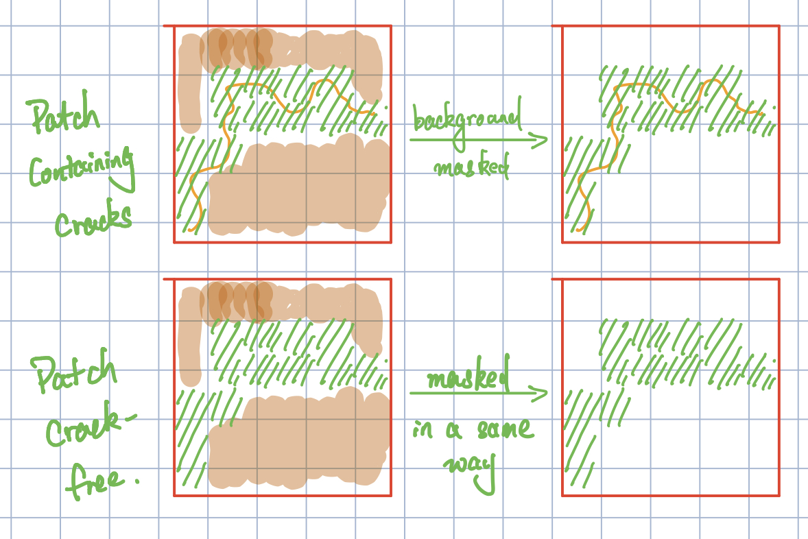
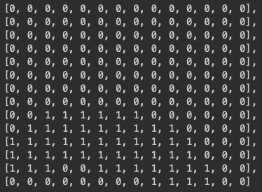
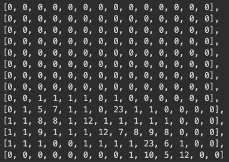

# Oct 9 2020
## Some problems:

The new datasets have a significant number of samples contatining red and yellow stones, which fails the data proprocessing algorithm. 

- the red and yellow stones were wrongly recognized as cracks
- the classifer does the predictions based on colors rather than the cracks.

## The new data distribution

|  Set  |   y   |   r   |   b   |  g   |   n    | Total  |
|-------|-------|-------|-------|------|--------|--------|
| Train | 34576 | 26626 | 21365 | 5022 | 388883 | 465127 |
| Valid | 12638 |  7399 | 10084 | 2111 | 32232  | 64464  |
|  Test | 13205 | 12444 | 12467 | 2926 | 41042  | 82084  |

## Previous model 
* parameters were fined-tuned.

### Model configurations
Idx| Name| Type| \# Params
-------|------|------|------|
0 | vgg16 frontend | Sequential      | 14 M  
1 | sharedClassifier  | ClassifierGroup | 12 M  
2 | classifierY       | Sequential      | 1 M   
3 | classifierR       | Sequential      | 1 M   
4 | classifierB       | Sequential      | 1 M   
5 | classifierG       | Sequential      | 1 M  

### Test results
|  Measures |  y   |  r   |  b   |  g   |
|-----------|------|------|------|------|
| Precision | 0.41 | 0.33 | 0.49 | 0.30 |
|   Recall  | 0.72 | 0.86 | 0.61 | 0.44 |
|  F1 Score | 0.52 | 0.48 | 0.55 | 0.35 |
|  Accuracy | 0.75 | 0.67 | 0.82 | 0.93 |

|    Y     | NoCrack | hasCrack |
|----------|---------|----------|
| NoCrack  |  44110  |  13865   |
| hasCrack |   3758  |   9447   |
 

|    R     | NoCrack | hasCrack |
|----------|---------|----------|
| NoCrack  |  36901  |  21835   |
| hasCrack |   1686  |  10758   |

|    B     | NoCrack | hasCrack |
|----------|---------|----------|
| NoCrack  |  50819  |   7894   |
| hasCrack |   4812  |   7655   |

|    G     | NoCrack | hasCrack |
|----------|---------|----------|
| NoCrack  |  65235  |   3019   |
| hasCrack |   1649  |   1277   |

## Data augmentation over cracks and backgrounds

- [Ver 1] When training the models, mask the background and only retain the cracks

- [Ver 2] Mask the background but the mask's opacity decreaes as the training proceeds

|  Measures |  y   |  r   |  b   |  g   |
|-----------|------|------|------|------|
| Precision | 0.33 | 0.31 | 0.31 | 0.16 |
|   Recall  | 0.51 | 0.71 | 0.43 | 0.08 |
|  F1 Score | 0.40 | 0.43 | 0.36 | 0.10 |
|  Accuracy | 0.72 | 0.67 | 0.73 | 0.95 |

- [Ver 3]** When training the models, replace the background by a crack-free patch.

<--> results

|  Measures |  y   |  r   |  b   |  g   |
|-----------|------|------|------|------|
| Precision | 0.43 | 0.35 | 0.49 | 0.34 |
|   Recall  | 0.71 | 0.84 | 0.63 | 0.42 |
|  F1 Score | 0.54 | 0.49 | 0.55 | 0.38 |
|  Accuracy | 0.77 | 0.70 | 0.82 | 0.94 |

- [Ver 4] Mask the background with the random mask opacity. 

<--> results

|  Measures |  y   |  r   |  b   |  g   |
|-----------|------|------|------|------|
| Precision | 0.33 | 0.29 | 0.43 | 0.18 |
|   Recall  | 0.61 | 0.79 | 0.54 | 0.61 |
|  F1 Score | 0.43 | 0.43 | 0.48 | 0.28 |
|  Accuracy | 0.70 | 0.63 | 0.79 | 0.87 |

- [Comparison] Mask the background both in the training and testing samples.

<--> results

|  Measures |  y   |  r   |  b   |  g   |
|-----------|------|------|------|------|
| Precision | 0.44 | 0.44 | 0.53 | 0.45 |
|   Recall  | 0.63 | 0.68 | 0.49 | 0.31 |
|  F1 Score | 0.52 | 0.53 | 0.51 | 0.37 |
|  Accuracy | 0.78 | 0.79 | 0.84 | 0.96 |

* The low F1 scores indicate that the classifiers cannot always classify the crack of different types.

## Directly reproducing the heatmap. 

- For each patch, we generate the heatmap for each crack type:

0: crack-free, 1:crack

Or, 

The number indicates the number of pixels considered as cracks.

And we train the model to directly reproducting the heatmap. 

## Artificial negative samples
###### Description
generate the training samples by pairing a crack-contained sample and an artificial negative one with the part containing the crack removed.

## Use models to train a model
###### Description
Train four detection models seperately first. Then use another networks to reproduce the probabilities generated by the four trained model. 

