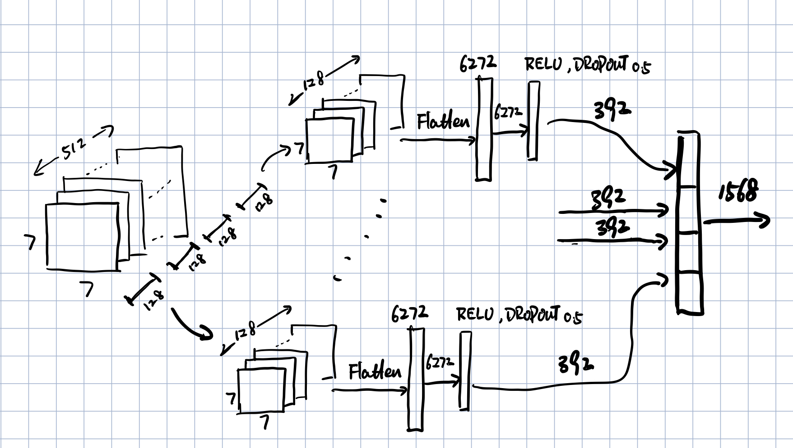

## Data Generation
For each image, we partition it into nine sub-squares:

In order to distribute each crack types evenly into training, validation and test dataset, we currently use

Training | Validation | Test
---------|------------|-----
1, 2, 3, 7, 8 | 0, 6| 4, 5

So we have the following crack distributions:

  Set  |  y   |  r   |  b   |  g   |   n    | Total  |
-------|------|------|------|------|--------|--------|
 Train | 2110 | 6591 | 2964 | 1373 | 962028 | 974968 |
 Valid | 681  | 906  | 1470 | 302  | 391220 | 394570 |
  Test | 472  | 3304 | 2668 | 778  | 381592 | 388780 |
  
In order to make the test accuracy score useful, we randomly picked 
\# Y + \# R + \# B + \# G Non-Crack patches to balance the label distribution. So the final dataset used for training and test is:

  Set  |  y   |  r   |  b   |  g   |   n    |
-------|------|------|------|------|--------|
 Train | 2110 | 6591 | 2964 | 1373 | 962028 |
 Valid | 681  | 906  | 1470 | 302  | 3359 |
  Test | 472  | 3304 | 2668 | 778  | 7222 |

## Model Configuration
Three components:
1. VGG16 frontend
2. Shared classifier component
3. Four seperate classifier for each crack type

#### Number of parameters (current implementation)
Idx| Name| Type| \# Params
-------|------|------|------|
0 | featureExtraction | Sequential      | 14 M  
1 | sharedClassifier  | ClassifierGroup | 12 M  
2 | classifierY       | Sequential      | 1 M   
3 | classifierR       | Sequential      | 1 M   
4 | classifierB       | Sequential      | 1 M   
5 | classifierG       | Sequential      | 1 M  

#### Number of parameters (Previous implementation)
Idx| Name| Type| \# Params
-------|------|------|------|
0 | featureExtraction | Sequential | 14 M  
1 | sharedClassifier  | Sequential | 196 M 
2 | classifierY       | Sequential | 7 M   
3 | classifierR       | Sequential | 7 M   
4 | classifierB       | Sequential | 7 M   
5 | classifierG       | Sequential | 7 M   

### VGG16 frontend
Input size: 3 x 224 x 224

Output size: 512 x 7 x 7

      (0): Conv2d(3, 64, kernel_size=(3, 3), stride=(1, 1), padding=(1, 1))
      (1): ReLU(inplace=True)
      (2): Conv2d(64, 64, kernel_size=(3, 3), stride=(1, 1), padding=(1, 1))
      (3): ReLU(inplace=True)
      (4): MaxPool2d(kernel_size=2, stride=2, padding=0, dilation=1, ceil_mode=False)
      (5): Conv2d(64, 128, kernel_size=(3, 3), stride=(1, 1), padding=(1, 1))
      (6): ReLU(inplace=True)
      (7): Conv2d(128, 128, kernel_size=(3, 3), stride=(1, 1), padding=(1, 1))
      (8): ReLU(inplace=True)
      (9): MaxPool2d(kernel_size=2, stride=2, padding=0, dilation=1, ceil_mode=False)
      (10): Conv2d(128, 256, kernel_size=(3, 3), stride=(1, 1), padding=(1, 1))
      (11): ReLU(inplace=True)
      (12): Conv2d(256, 256, kernel_size=(3, 3), stride=(1, 1), padding=(1, 1))
      (13): ReLU(inplace=True)
      (14): Conv2d(256, 256, kernel_size=(3, 3), stride=(1, 1), padding=(1, 1))
      (15): ReLU(inplace=True)
      (16): MaxPool2d(kernel_size=2, stride=2, padding=0, dilation=1, ceil_mode=False)
      (17): Conv2d(256, 512, kernel_size=(3, 3), stride=(1, 1), padding=(1, 1))
      (18): ReLU(inplace=True)
      (19): Conv2d(512, 512, kernel_size=(3, 3), stride=(1, 1), padding=(1, 1))
      (20): ReLU(inplace=True)
      (21): Conv2d(512, 512, kernel_size=(3, 3), stride=(1, 1), padding=(1, 1))
      (22): ReLU(inplace=True)
      (23): MaxPool2d(kernel_size=2, stride=2, padding=0, dilation=1, ceil_mode=False)
      (24): Conv2d(512, 512, kernel_size=(3, 3), stride=(1, 1), padding=(1, 1))
      (25): ReLU(inplace=True)
      (26): Conv2d(512, 512, kernel_size=(3, 3), stride=(1, 1), padding=(1, 1))
      (27): ReLU(inplace=True)
      (28): Conv2d(512, 512, kernel_size=(3, 3), stride=(1, 1), padding=(1, 1))
      (29): ReLU(inplace=True)
      (30): MaxPool2d(kernel_size=2, stride=2, padding=0, dilation=1, ceil_mode=False)

### sharedClassifier
Input size: 512 x 7 x 7
Output size: 1568 x 1

### classifierY, classifierR, classifierB and classifierG
Input size: 1568 x 1
Output size: 1 x1

	(0): Linear(in_features=1568, out_features=784, bias=True)
    (1): ReLU(inplace=True)
    (2): Dropout(p=0.5, inplace=False)
    (3): Linear(in_features=784, out_features=1, bias=True)
    
    
## Training

	batch_size = 96
	precision = 16

Idx| Name| Learning Rate:
-------|------|------|------|
0 | featureExtraction | 1e-5
1 | sharedClassifier  | 1e-5
2 | classifierY       | 2e-5
3 | classifierR       | 2e-5
4 | classifierB       | 2e-5
5 | classifierG       | 2e-5

### Learning rate scheduler
If the validation loss does not drop (with patience 7)
	
	learning rate * 0.1 

### Batch-wise Pos-Neg label balancing
Given a batch of images, for each crack type, count 

	 numPos := # positive samples
	 numNeg := # negative samples
	 ratio := numNeg/numPos
	 
Then the loss function:
$$loss = - [ratio \cdot y\cdot \log(\hat{y}) + (1-y)\cdot \log(1-\hat{y})]$$

### Asymmetric Label smoothing
Only assume that there is 1% possibility that a crack is missed 

* (CivilEng group said they might miss a crack but it is unlikely to label a perfect concrete having cracks)

$$
y\cdot loss(\hat{y}, y)+(1-y)\cdot [0.99\cdot loss(\hat{y}, y)+0.01\cdot loss(\hat{y}, 1-y)]
$$

## Results
The competing relationship among the different crack types are largely alliviated. 

* The alleviation is not due to the modification of the model, but the adjustment of the learning rate and the introduction of the batch-wise Pos-Neg label balancing

* [Current model training dynamics](https://tensorboard.dev/experiment/LPZ8eyn0ROyIBMZ8SbrpSA/).
* [Previous model training dynamics](https://tensorboard.dev/experiment/XV80KrRaT72gBtPfAsmmkw/).
<table>
<tr><th> Current Model </th><th> Previous Model</th></tr>
<tr><td>

  Measures |  y   |  r   |  b   |  g   |
---------- | ---- | ---- | ---- | -----|
 Precision | 0.32 | 0.90 | 0.84 | 0.82 |
   Recall  | 0.82 | 0.88 | 0.57 | 0.73 |
  F1 Score | 0.46 | 0.89 | 0.68 | 0.78 |
  Accuracy | 0.87 | 0.90 | 0.80 | 0.95 |

</td><td>

  Measures |  y   |  r   |  b   |  g   |
---------- | ---- | ---- | ---- | -----|
 Precision | 0.14 | 0.87 | 0.65 | 0.26 |
   Recall  | 1.00 | 0.95 | 0.72 | 0.90 |
  F1 Score | 0.24 | 0.91 | 0.68 | 0.41 |
  Accuracy | 0.59 | 0.92 | 0.75 | 0.72 |

</td></tr> 
</table>
<table>
<tr><th> Current Model </th><th> Previous Model</th></tr>
<tr><td>

|    Y     | NoCrack | hasCrack |
---------- | ---- | ---- |
| NoCrack  |   5883  |   833    |
| hasCrack |    87   |   385    |

</td><td>

|    Y     | NoCrack | hasCrack |
---------- | ---- | ---- |
| NoCrack  |   3753  |   2963   |
| hasCrack |    0    |   472    |

</td></tr> 
</table>
<table>
<tr><td>

    R     | NoCrack | hasCrack |
---------- | ---- | ---- |
 NoCrack  |   3549  |   335    |
 hasCrack |   406   |   2898   |

</td><td>

|    R     | NoCrack | hasCrack |
---------- | ---- | ---- |
| NoCrack  |   3428  |   456    |
| hasCrack |   153   |   3151   |

</td></tr> 
</table>
<table>
<tr><td>

|    B     | NoCrack | hasCrack |
---------- | ---- | ---- |
| NoCrack  |   4230  |   290    |
| hasCrack |   1135  |   1533   |

</td><td>

|    B     | NoCrack | hasCrack |
---------- | ---- | ---- |
| NoCrack  |   3470  |   1050   |
| hasCrack |   756   |   1912   |

</td></tr> 
</table>
<table>
<tr><td>

|    G     | NoCrack | hasCrack |
|----------|---------|----------|
| NoCrack  |   6288  |   122    |
| hasCrack |   208   |   570    |

</td><td>

|    G     | NoCrack | hasCrack |
|----------|---------|----------|
| NoCrack  |   4457  |   1953   |
| hasCrack |    75   |   703    |

</td></tr> 
</table>

