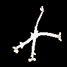

# Jan 22

<!--**SPR - 16 - E1**
   

**SPR - 16 - E4**
   -->

# Count nodes instead of cracks

Assuming that the cracks on concretes are forest (i.e, acyclic), then

$$ \mbox{Num of cracks} = \frac{1}{2} \left[N_1 + \sum_{i=3}^{\infty} (i-2) N_i \right]$$

where $N_i$ is the number of nodes of type $i$.

Instead of counting cracks, we can count number of nodes of different types.

# Synthetic data generation

We created samples containing Nodes of type $1$, $3$, $4$ and $5$. Some noise is added to make the cracks similar to the natural one:

Besides, we also created the correpsonding density maps for each type of nodes.

For instance, for nodes of  type 1:
   

For nodes of type 1, 3, 4, 5:
     

# A UNet-based node detection model

This network works well to detect nodes and seperate type 2 nodes from the others. 

#### Detection of nodes of type 1

   

#### Detection of nodes of type 3, 4, 5
1. Density map of type 3, 4, 5 for the same input image

  

# Classification of nodes of type 3, 4, 5
After detecting the nodes of types other than 1, we extract the image patch surrounding it:

Then we feed it into another network: 

We used $10,000$ for training, $1,000$ for validation and $1,000$ for testing.

The model achieved $0.988$ accuracy.

**Note:** Extra analysis implies that the UNet-based network fails because the node type is not based on the pixel-wise features, which implies a need to develop a model that is a mixture of pixel-wise and regular classification models. 