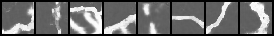

# March 05

<!--**SPR - 16 - E1**
   

**SPR - 16 - E4**
   -->

## Task 1

Given:
1. a small dataset containing (image, perfect mask, noisy mask)
2. a large dataset containing (image, noisy mask)

|                 Exp Name                |      dice_loss      |
|-----------------------------------------|---------------------|
|  use denoised mask      | 0.45287594199180603 |
| 	use perfect masks only  |  0.4660969376564026 |
|  pseudo labeling          |  0.6596523523330688 |
|  if all lebels are perfect |  0.3286687731742859 |

## Task 2

Given:
1. A large dataset containing (image, noisy mask)

Cropped
 

Original
 

Recovered
 

|                 Exp Name                |      dice_loss      |
|-----------------------------------------|---------------------|
|  directly use noisy masks    | 0.3015390932559967 |
| 	use denoised mask			 |  0.3351624608039856 |