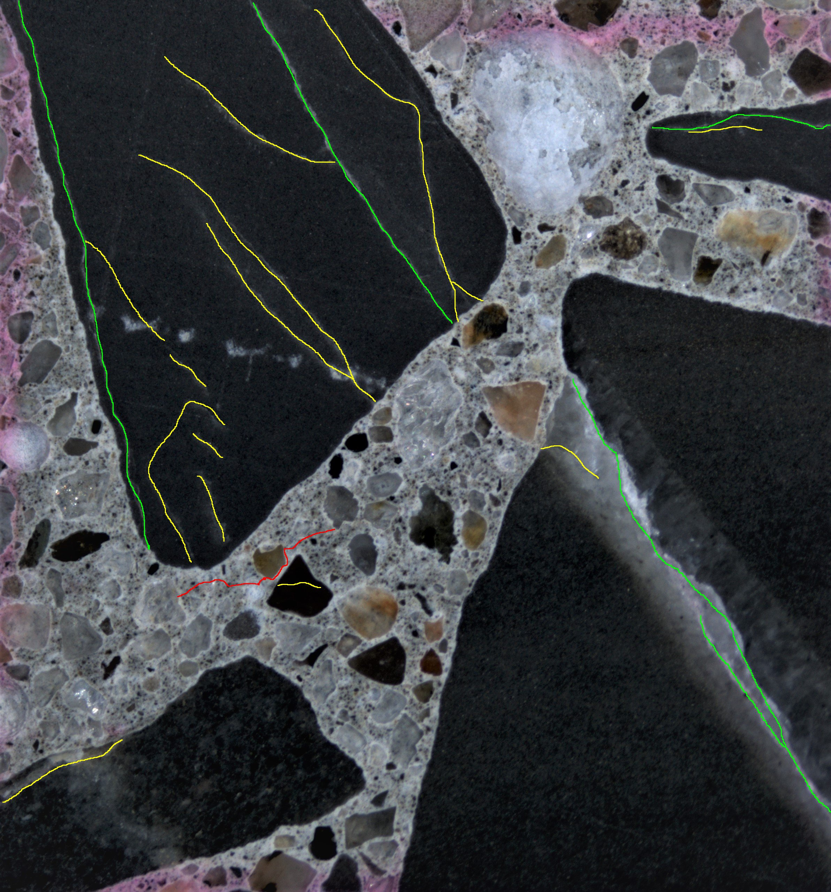

# Crack detection flowchart

Given a raw input image, our machine learning algorithm makes two predictions

1. detect cracks 
2. for each pixel, give the probabilities that the pixel belongs to three crack type (Y, R, BG), respectively. 

For instance, feeding this image into the model:

  

we can get the two raw predictions (left: crack location, right: crack types):

   
 
In the right image, we visualized the prediction results, where Y (Red), R (Green), BG (Blue).

Then we use some computer vision techniques to improve the prediction quality.

#### Processing details:

1. Remove weak pixels (left: input, right: week pixels removed):
  
The process will remove weak white noise. 

2. Find all the connected components:

3. For each component, find a bounding box (in red) that has the least area

4. For each component, if the length of the diagonal of the bounding box is less than $300$, remove it. (Step 3 and 4 together remove small cracks)

5. For each component, check the corresponding area of the crack type prediction image and get the type of majority on pixel level. Color the componenet with the major type:
 

 
##### After process / ground truth:
 
Y (Red), R (Green), BG (Blue)
   
