# Oct 22 2020

## Synthetic data generation

### Preliminary method (the method without smoothness)
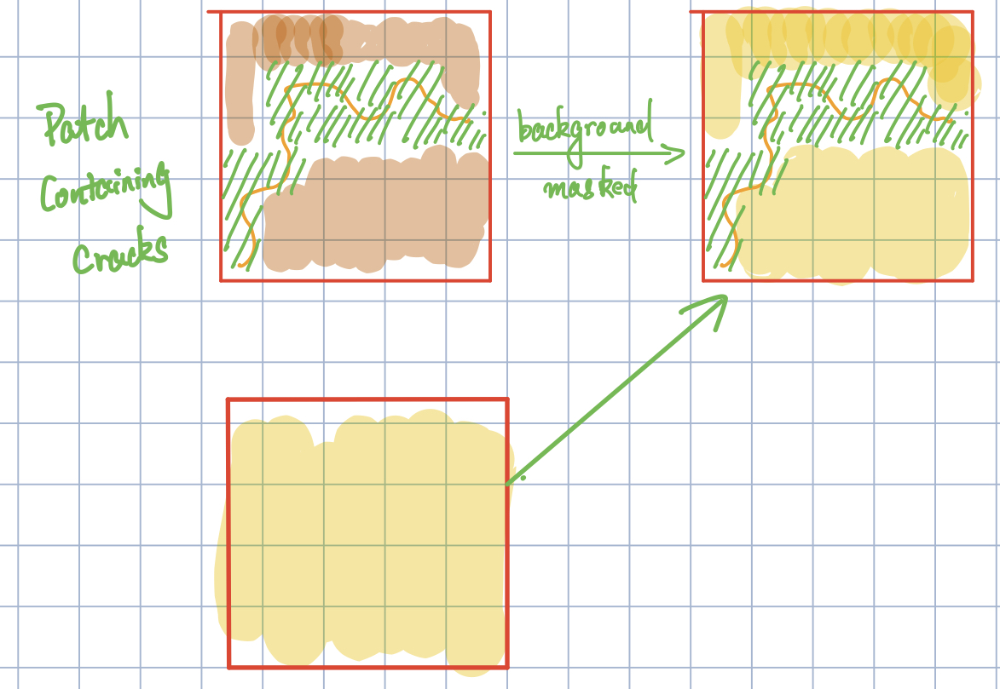
 
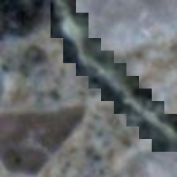

### Smooth the boundary

We use a gaussian filter to smooth the mask. Here is a synthetic sample it generates

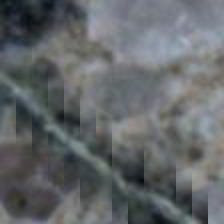

### Change the background brightness following a Beta distribution
The brightness follows the beta distribution $\mathcal{B}(2,10)$. Its density function is plotted below:

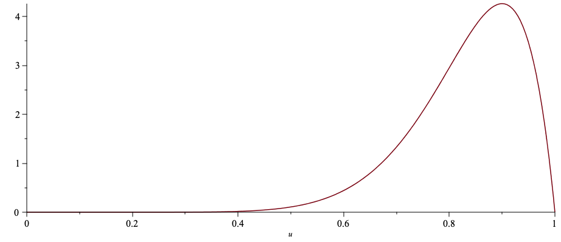

Some generated samples:

  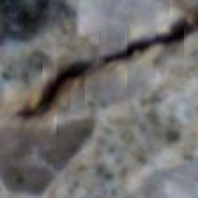 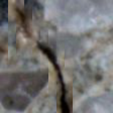

### The portion of the synthetic data

Version 1: half real data and half synthetic data

Version 2: decreases the portion of the synthetic data exponentially, in particular,

~~~ python
portion = 0.5 * (0.95**current_epoch)
~~~

### Multiple crack patch mixture. 
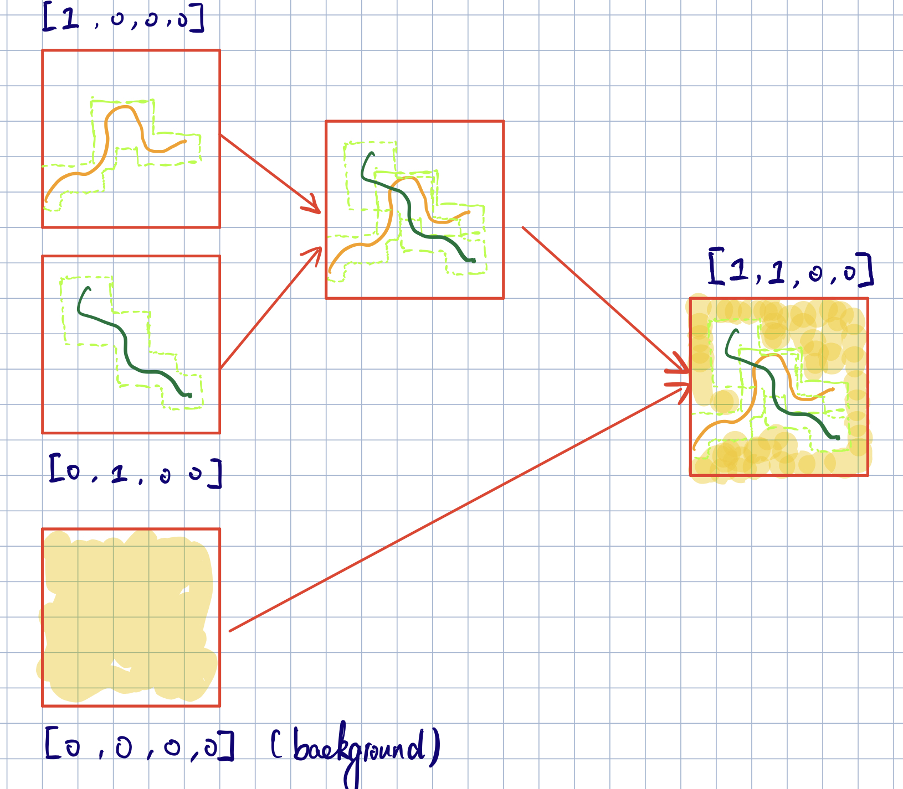

The number of images containing cracks follows a categorical distribution 

| # samples | 1 | 2 | 3 |
|-----------|---|---|---|
| Prob.     | 0.7 | 0.2 | 0.1 |

Here are some generated samples:

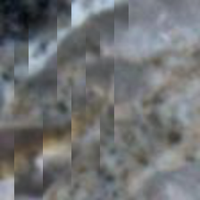 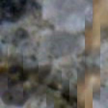 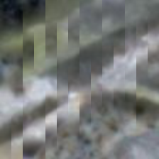 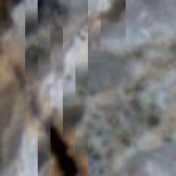

## Test

### The data distribution

|  Set  |  y   |  r   |  b   |  g  |   n   | Total |
|-------|------|------|------|-----|-------|-------|
| Train | 2091 | 1627 | 1342 | 302 | 21652 | 26291 |
| Valid | 706  | 417  | 591  | 129 |  1843 | 3686 |
|  Test | 830  | 766  | 775  | 177 |  2548 | 5096 |

### Test results

**F1 Score**

| Method | Boundary smoothed | Portion of synthetic data |  y   |  r   |  b   |  g   | Avg |
|--------|-------------------|---------------------------|------|------|------|------| ----|
|Original (old)| N.A | N.A | 0.52 | 0.48 | **0.55** | 0.35 | 0.475|
|Original (new)| N.A | N.A | *0.54* | 0.45 | 0.48 | 0.47 | 0.485|
|Single crack patch| No | 0.5 |**0.55** | 0.50 | *0.53* | *0.49* | *0.5175* |
|Single crack patch| No | exponentially decrese |**0.55** | **0.52** | 0.52 | 0.44 | 0.5075 |
|Single crack patch| Yes | 0.5 | 0.53 | 0.50 | **0.55** | **0.50** | **0.52** |
|Single crack patch| Yes | exponentially decrese | 0.53 | *0.51* | *0.53* | 0.48 | 0.5125 |
|Multi crack patch| Yes | 0.5 | *0.54* | *0.51* | *0.53* | 0.46 | 0.51|
|Multi crack patch| Yes | exponentially decrese | 0.52 | 0.48 | **0.55** | **0.50** | 0.5125

**Accuracy**

| Method | Boundary smoothed | Portion of synthetic data |  y   |  r   |  b   |  g   | Avg |
|--------|-------------------|---------------------------|------|------|------|------| ----|
|Original (old)| N.A				  | N.A | 0.75 | 0.67 | 0.82 | 0.93 | 0.7925 |
|Original (new)| N.A				  | N.A | **0.84** | **0.83** | **0.86** | **0.97** | **0.875** |
|Single crack patch| No | 0.5 | 0.82 | 0.77 | *0.85* | **0.97** | 0.8525 |
|Single crack patch| No | exponentially decrese | **0.84** | *0.80* | *0.85* | *0.96* | *0.8625*|
|Single crack patch| Yes | 0.5 | 0.82 | 0.78 | *0.85* | **0.97** | 0.855 |
|Single crack patch| Yes | exponentially decrese | 0.79 | *0.80* | *0.85* | **0.97** | 0.8525 |
|Multi crack patch| Yes | 0.5 | *0.83* | 0.79 | *0.85* | *0.96* | 0.8575 |
|Multi crack patch| Yes | exponentially decrese | 0.76 | 0.78 | *0.85* | *0.96* | 0.8375 |

